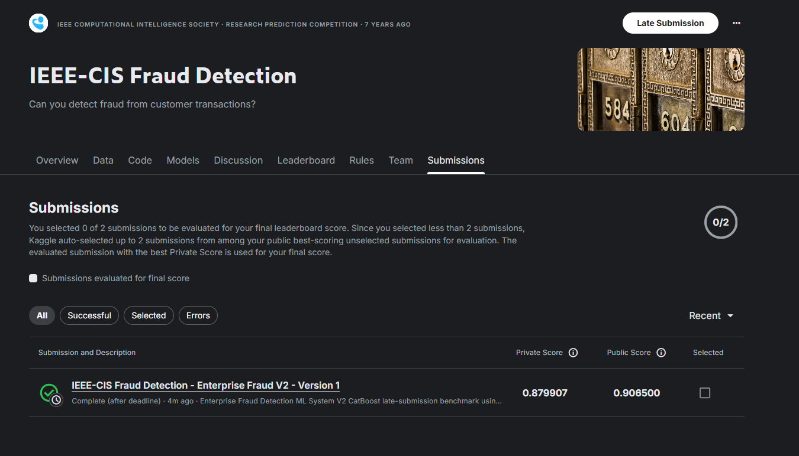
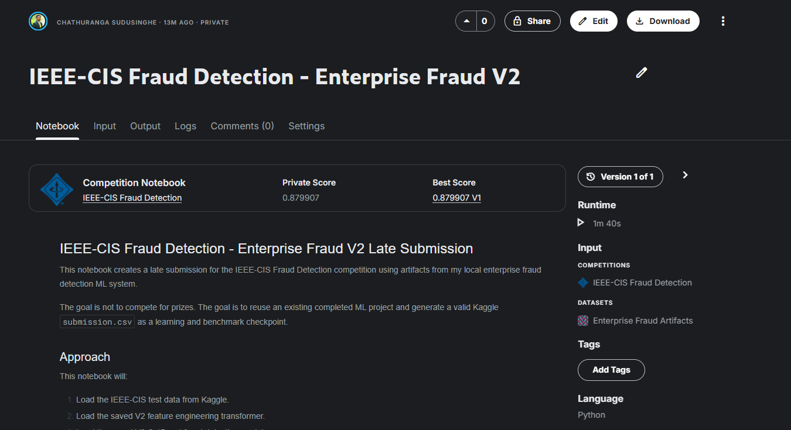
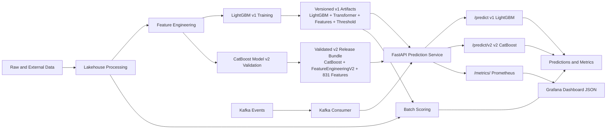

# Enterprise Fraud Detection ML System

A production-oriented fraud detection ML system combining LightGBM v1 serving through `POST /predict`, CatBoost Model v2 serving through `POST /predict/v2`, FastAPI inference, model-aware Prometheus monitoring, Grafana dashboard readiness, a local lakehouse workflow, batch scoring, basic Kafka event processing, Airflow orchestration definitions, Docker packaging, CI validation, and AWS Terraform infrastructure scaffolding.

This repository is built as a serious AI/ML engineering project, not a notebook-only demo. It contains implemented model artifacts, API serving code, local data workflow components, orchestration definitions, monitoring hooks, dashboard JSON, and infrastructure code. The Model v2 work has reached a controlled production-readiness checkpoint, but the system should not be described as currently live in public production or live on AWS without separate deployment validation evidence.

## Project overview

The project demonstrates how transaction fraud detection can be organized as an end-to-end ML system:

- Local lakehouse-style data organization
- Feature engineering for tabular transaction and identity data
- LightGBM v1 inference on `POST /predict`
- CatBoost Model v2 inference on `POST /predict/v2`
- FastAPI inference using persisted models and transformers
- Model v2 artifact validation and reproducibility checks
- Model v2 GitHub Release asset strategy for large artifacts
- Model-aware Prometheus metrics
- Grafana dashboard JSON for Model v2 API monitoring
- Batch scoring scripts for offline prediction
- Basic Kafka consumer-to-API event processing
- Airflow DAG definitions for batch scoring and retraining workflows
- Docker packaging for local API and streaming components
- GitHub Actions CI for tests and Docker image build
- Terraform modules for AWS infrastructure scaffolding
- Governance documentation and AI usage disclosure

The current system is best described as production-oriented and portfolio-grade, with Model v2 ready for controlled rollout review. Several infrastructure components remain scaffolding or locally validated only, and AWS production deployment is not claimed.

## Business problem

Fraud detection systems must identify suspicious transactions while managing operational review capacity. A useful fraud model is not only a high-AUC classifier; it must also produce an operating point that balances fraud capture, false positives, alert volume, analyst workload, auditability, and reproducibility.

This project focuses on that engineering problem:

- Train and serve a tabular fraud model.
- Preserve feature and artifact contracts between training and inference.
- Track threshold behavior separately from model quality.
- Support batch and near-real-time scoring patterns.
- Keep human review and governance explicit.

## Key outcomes

Verified repository evidence shows:

- LightGBM validation ROC-AUC is approximately `0.93` across historical baseline evidence.
- The validation set contains `85,430` transactions.
- The validation fraud count is `2,994`.
- Model v1 `/predict` remains the unchanged LightGBM serving path.
- Model v1 runtime feature contract contains `445` features.
- Model v2 `/predict/v2` serves the validated CatBoost candidate.
- Model v2 uses `FeatureEngineeringV2` with `831` transformed features.
- Model v2 threshold is `0.10`.
- The deep learning baseline was evaluated but did not beat the CatBoost Model v2 candidate.
- PyTorch remains optional and is not required for normal CI or API serving.
- Model v2 artifact reproducibility validation passed.
- Model v2 artifacts are distributed as a GitHub Release bundle, not committed to Git.
- Model v2 was submitted to the IEEE-CIS Fraud Detection Kaggle competition as a late-submission benchmark.
- The late-submission benchmark achieved Public ROC-AUC `0.906500` and Private ROC-AUC `0.879907`.
- API smoke testing passed for `GET /health`, `POST /predict`, and `POST /predict/v2`.
- Monitoring smoke testing passed for model-aware Prometheus labels.
- Full pytest passed with `176 passed`.
- Versioned model, transformer, feature columns, threshold, and metadata artifacts exist for v1 locally; v2 large artifacts are expected from the release bundle.
- Batch scoring has historical output and manifest evidence.
- Basic Kafka-to-FastAPI scoring is implemented locally.

The v1 ROC-AUC values come from historical notebook, artifact, and manifest evidence. Model v2 readiness is based on the validated CatBoost promotion path, release artifact validation, API integration, smoke testing, monitoring, and dashboard readiness.

## Kaggle late-submission benchmark

The completed Enterprise Fraud Detection ML System V2 CatBoost model was submitted to the IEEE-CIS Fraud Detection Kaggle competition as a late-submission benchmark. The objective was to reuse the completed local ML system, generate a valid Kaggle `submission.csv`, and record the score as an external benchmark. This was not a prize competition attempt.

| Item | Value |
|---|---|
| Competition | IEEE-CIS Fraud Detection |
| Kaggle notebook | IEEE-CIS Fraud Detection - Enterprise Fraud V2 |
| Model | Enterprise Fraud V2 CatBoost |
| Feature engineering | `FeatureEngineeringV2` |
| Transformed feature count | `831` |
| Public ROC-AUC | `0.906500` |
| Private ROC-AUC | `0.879907` |
| Submission type | Late submission |
| Kaggle status | Complete after deadline |
| Purpose | External learning and benchmark checkpoint, not a prize attempt |





## Evidence and audit reports

- [Current project repository audit](docs/reports/current_project_repository_audit.md)
- [LightGBM baseline reconciliation](docs/reports/lightgbm_baseline_reconciliation.md)
- [Repository architecture and capability audit](docs/reports/repository_architecture_and_capability_audit.md)
- [Model v2 CatBoost artifact promotion plan](docs/model_v2_catboost_artifact_promotion_plan.md)
- [Model v2 API integration plan](docs/model_v2_api_integration_plan.md)
- [Model v2 monitoring and rollback plan](docs/model_v2_monitoring_rollback_plan.md)
- [Model v2 API smoke test results](docs/model_v2_api_smoke_test_results.md)
- [Model v2 monitoring smoke test results](docs/model_v2_monitoring_smoke_test_results.md)
- [Model v2 production readiness report](docs/model_v2_production_readiness_report.md)

## Current project status

| Area | Status | Evidence |
|---|---|---|
| FastAPI inference | Implemented | `api/main.py` |
| Active inference implementation | Implemented | `ml/inference/predict.py` |
| Persisted LightGBM artifacts | Implemented | `model_artifacts/` |
| Runtime artifact loading | Validated | Audit inspection verified model, transformer, feature columns, metadata, and threshold loading |
| Runtime feature contract | Validated | 445 features in `feature_columns_v1.json` |
| Runtime threshold | Implemented | Artifact fact: `0.008540712517184246` in `threshold_v1.json` |
| Official business operating threshold | Planned | Notebook and persisted artifact use different threshold objectives; decision not finalized |
| Model v2 `/predict/v2` endpoint | Implemented | `api/main.py` and `ml/inference/predict_v2.py` |
| Model v2 CatBoost artifacts | Release asset, validated | Tag `model-v2-catboost-artifacts-2026-06-27`, asset `model_v2_catboost_artifacts.zip` |
| Model v2 artifact validation | Passed | Reproducibility validation confirmed required files, 831 features, threshold `0.10`, metadata, and joblib loading |
| Model-aware Prometheus metrics | Implemented | `api_requests_total` and `api_request_latency_seconds` labels distinguish endpoint, model version, family, and status |
| Grafana dashboard JSON | Added and validated | `monitoring/grafana/dashboards/model_v2_api_dashboard.json` |
| Controlled Model v2 production-readiness checkpoint | Completed | Release/tag `model-v2-production-ready-2026-06-27`; readiness report added |
| Lakehouse workflow | Implemented | Local lakehouse directories and transformation scripts exist |
| Batch scoring | Validated | Historical batch manifest and prediction parquet evidence exist |
| Kafka event processing | Simulated | Basic local consumer posts Kafka messages to FastAPI |
| Airflow orchestration | Implemented | DAG definitions exist; retraining DAG has missing registry dependency |
| Docker packaging | Implemented | API and streaming Dockerfiles |
| AWS Terraform | Implemented | Terraform scaffolding modules and dev environment exist |
| Current AWS deployment | Unsupported | No current live endpoint evidence in repo audit |
| CI | Implemented | Tests and Docker build are configured in GitHub Actions |
| Full CD | Unsupported | No deployment job found |
| Agentic AI | Planned | No runtime implementation evidence |
| Selective inference | Planned | No runtime implementation evidence |

## Verified system architecture

```text
Local data and artifacts
  -> lakehouse raw / external / processed / curated / splits
  -> feature engineering, LightGBM v1 training, and CatBoost Model v2 validation
  -> model_artifacts/*_v1
  -> GitHub Release bundle for large Model v2 artifacts
  -> FastAPI runtime
  -> /predict v1 LightGBM
  -> /predict/v2 v2 CatBoost
  -> /metrics/ Prometheus metrics
  -> Grafana dashboard JSON

Batch path
  -> lakehouse/transformations/process_test_batch.py
  -> lakehouse/transformations/transform_test_batch.py
  -> lakehouse/transformations/run_batch_prediction.py

Streaming path
  -> Kafka topic
  -> api/streaming/consumer.py
  -> FastAPI /predict

Orchestration and deployment definitions
  -> Airflow DAG definitions
  -> Dockerfiles and docker-compose.yml
  -> Terraform AWS modules
  -> GitHub Actions CI
```



## Active runtime path

The active v1 API path is:

```text
uvicorn api.main:app
  -> api/main.py
  -> FraudPredictor()
  -> ml/inference/predict.py
  -> model_artifacts/fraud_lgbm_v1.joblib
  -> model_artifacts/feature_transformer_v1.joblib
  -> model_artifacts/feature_columns_v1.json
  -> model_artifacts/threshold_v1.json
```

The active v2 API path is:

```text
uvicorn api.main:app
  -> api/main.py
  -> FraudPredictorV2()
  -> ml/inference/predict_v2.py
  -> model_artifacts/fraud_catboost_v2.joblib
  -> model_artifacts/feature_transformer_v2.joblib
  -> model_artifacts/feature_columns_v2.json
  -> model_artifacts/metadata_v2.json
  -> model_artifacts/threshold_v2.json
```

Verified facts:

- Active API entry point: `api/main.py`
- Active v1 inference implementation: `ml/inference/predict.py`
- Active v2 inference implementation: `ml/inference/predict_v2.py`
- Active artifacts directory: `model_artifacts/`
- Active v1 model artifact: `fraud_lgbm_v1.joblib`
- Active v1 transformer artifact: `feature_transformer_v1.joblib`
- Active v1 feature contract: `feature_columns_v1.json`
- Active v1 threshold file: `threshold_v1.json`
- Model v2 artifacts are expected locally from the GitHub Release bundle, not committed to Git.
- Model v2 release tag: `model-v2-catboost-artifacts-2026-06-27`
- Model v2 artifact bundle: `model_v2_catboost_artifacts.zip`

`api/inference.py` is not the active API path and is stale or broken because it expects `fraud_lgbm_v1.pkl`, while the tracked model artifact is `fraud_lgbm_v1.joblib`.

## Dataset and time-based evaluation

The repository evidence points to IEEE-CIS-style transaction and identity fraud data stored locally under lakehouse directories:

- `lakehouse/raw/`
- `lakehouse/external/`
- `lakehouse/processed/`
- `lakehouse/curated/`
- `lakehouse/splits/`

The project uses pre-split parquet files for training and validation:

- `lakehouse/splits/X_train.parquet`
- `lakehouse/splits/X_val.parquet`
- `lakehouse/splits/y_train.parquet`
- `lakehouse/splits/y_val.parquet`

Notebook and audit evidence report:

- Training rows: `505110`
- Validation rows: `85430`
- Validation fraud rows: `2994`
- Runtime feature count: `445`

The project describes a time-aware evaluation setup, and `TransactionDT` is used in feature engineering. However, the audit did not find a tracked, reusable split-generation script that fully proves the time-based split from raw data. The split should be treated as historical local evidence until a reproducible split builder and dataset manifest are added.

## Feature engineering

Feature engineering is implemented in `ml/training/feature_engineering.py` through `FraudFeatureEngineeringEngine`.

Implemented feature groups include:

- Required transaction fields: `TransactionDT`, `TransactionAmt`, `card1`, `card2`, `card3`, `card4`, `addr1`
- Time features: `day`, `hour`
- UID construction from `card1` and `addr1`
- Frequency encodings for `card1`, `card2`, `card3`, and `card4`
- UID aggregation statistics:
  - transaction count
  - amount mean
  - amount standard deviation
  - amount median
  - amount deviation
- Categorical-level freezing for training-serving consistency

Important feature-contract caveat:

- The persisted runtime transformer and feature contract include `uid_time_to_next` and `uid_time_from_prev`.
- Current `ml/training/feature_engineering.py` does not visibly reproduce those two fields.
- Notebook evidence includes those fields.
- This means the current runtime artifact contract cannot yet be assumed fully reproducible from the current source without a controlled compatibility check.

## LightGBM baseline reconciliation

The repository contains two LightGBM baseline stories. Both are useful evidence, but neither is yet the official fully reproducible baseline.

| Baseline | Evidence | Threshold objective | ROC-AUC | Recall | Alert rate | Status |
|---|---|---|---:|---:|---:|---|
| Notebook business-constrained baseline | `notebooks/05_model_baseline_lightgbm.ipynb` | Max recall under alert rate <= 8% | `0.9271426058483117` | `0.7321` | `0.0765` | Validated |
| Persisted API artifact baseline | `model_artifacts/` and `artifacts/runs/training_20260304T155620Z/manifest.json` | 95% recall constraint with precision selection | `0.9306685207962629` | `0.9502338009352037` | `0.3914198759218073` | Validated |

The active API uses the persisted artifact baseline, not the notebook `0.05` threshold.

## Threshold and business operating-point status

Current runtime threshold:

```text
0.008540712517184246
```

This value is an artifact fact. It is stored in:

- `model_artifacts/threshold_v1.json`
- `model_artifacts/metadata_v1.json`
- `artifacts/runs/training_20260304T155620Z/manifest.json`

It should not be described as the approved business operating threshold yet.

Threshold comparison:

- Notebook threshold `0.05` was selected under an 8% alert-rate constraint.
- Persisted threshold `0.008540712517184246` was selected under a 95% recall constraint.
- These are different business objectives.
- The persisted threshold has much higher recall but a much higher alert rate.
- The notebook threshold has lower alert volume but lower recall.

The project still needs an official baseline freeze that records dataset version, split provenance, validation predictions, artifact hashes, business constraints, and the approved threshold objective.

## Model artifacts and feature contract

Active v1 model artifacts:

```text
model_artifacts/
  fraud_lgbm_v1.joblib
  feature_transformer_v1.joblib
  feature_columns_v1.json
  metadata_v1.json
  threshold_v1.json
```

Verified artifact facts:

- Model class: LightGBM classifier
- Runtime feature count: `445`
- Best iteration: `361`
- Stored threshold: `0.008540712517184246`
- Stored metadata file: `metadata_v1.json`
- Stored feature contract: `feature_columns_v1.json`

Model v2 artifact strategy:

```text
GitHub Release
  tag: model-v2-catboost-artifacts-2026-06-27
  asset: model_v2_catboost_artifacts.zip
```

Expected local/server v2 artifact files after extracting the release bundle:

```text
model_artifacts/
  fraud_catboost_v2.joblib
  feature_transformer_v2.joblib
  feature_columns_v2.json
  metadata_v2.json
  threshold_v2.json
  model_v2_evaluation_report.json
```

Verified Model v2 artifact facts:

- Model family: CatBoost
- Feature engineering: `FeatureEngineeringV2`
- Transformed feature count: `831`
- Threshold: `0.10`
- Artifact reproducibility validation: passed
- Large v2 artifacts are intentionally not committed to Git
- Deep learning baseline: evaluated, not selected
- PyTorch requirement: optional only; not required for normal CI or API serving

Reproducibility gaps:

- Full split hashes are incomplete.
- Validation probability artifacts are not tracked.
- Artifact hashes for all runtime artifacts are not recorded in one complete manifest.
- The persisted manifest references an older local path and a Git SHA that was not available in the current local Git object database during audit.

## FastAPI inference

Implemented API endpoints in `api/main.py`:

- `GET /`
- `GET /health`
- `POST /predict`
- `POST /predict/v2`
- `GET /metrics` through a mounted Prometheus ASGI app

v1 prediction flow:

```text
POST /predict
  -> TransactionInput(data: dict)
  -> pandas DataFrame
  -> FraudPredictor.predict()
  -> feature transformer
  -> feature-column alignment
  -> LightGBM predict_proba
  -> threshold decision
  -> fraud_probability and fraud_prediction response
  -> JSONL metrics append
```

Implemented:

- FastAPI app
- Health endpoint
- v1 prediction endpoint
- v2 prediction endpoint
- Prometheus request count and latency metrics with model-aware labels
- File-based API metric logging through `artifacts/metrics/api_metrics.jsonl`

Current limitations:

- Request schema is `data: dict`, not a strict transaction schema.
- No authentication or authorization was found.
- No readiness endpoint was found.
- No model version is returned in the v1 `/predict` response by design; the v2 `/predict/v2` response includes model metadata.
- No rate limiting or request-size controls were found.

## Model v2 CatBoost endpoint

Model v2 is served separately from v1.

Endpoint:

```text
POST /predict/v2
```

Model v2 serving facts:

| Item | Value |
|---|---|
| Model family | CatBoost |
| Candidate | CatBoost default |
| Feature engineering | `FeatureEngineeringV2` |
| Feature count | `831` |
| Threshold | `0.10` |
| Artifact source | GitHub Release bundle, extracted locally/server-side |

`POST /predict/v2` response fields:

```text
fraud_probability
fraud_prediction
threshold
model_version
model_family
feature_count
```

Safety behavior:

- `/predict` remains v1 and unchanged.
- `/predict/v2` uses a separate `FraudPredictorV2` path.
- `/predict/v2` validates v2 metadata, feature count, feature order, and transformed feature quality before scoring.
- `/predict/v2` fails closed on v2 validation or runtime prediction failure.
- Silent v1 fallback from `/predict/v2` is not part of the first implementation.

## Data lakehouse workflow

The local lakehouse layout separates data by processing stage:

```text
lakehouse/
  raw/
  external/
  processed/
  curated/
  splits/
  transformations/
```

Tracked workflow scripts:

- `scripts/build_curated_dataset.py`
- `lakehouse/transformations/process_test_batch.py`
- `lakehouse/transformations/transform_test_batch.py`
- `lakehouse/transformations/run_batch_prediction.py`

Known issue:

- `scripts/ingest_raw_to_parquet.py` appears broken because it uses `Path(__file__).resolve().parent[1]`.

The lakehouse workflow is implemented locally, but the ignored local data files and historical path references mean the full data pipeline should not yet be described as fully reproducible from a fresh clone.

## Batch scoring

Batch scoring is implemented through lakehouse transformation scripts:

```text
external test data
  -> processed/test_merged.parquet
  -> curated/test_batch_curated.parquet
  -> curated/test_batch_predictions.parquet
  -> artifacts/runs/batch_*/manifest.json
```

Evidence:

- `lakehouse/transformations/process_test_batch.py`
- `lakehouse/transformations/transform_test_batch.py`
- `lakehouse/transformations/run_batch_prediction.py`
- `artifacts/runs/batch_20260304T155733Z/manifest.json`

Status:

- Implemented and previously demonstrated locally.
- Not validated in this README rebuild.
- Not presented as a production batch scoring service.

## Kafka streaming status

Kafka support is basic and local-oriented.

Implemented:

- `docker-compose.yml` defines a single-node Kafka broker in KRaft mode.
- `api/streaming/producer.py` sends a sample transaction event.
- `api/streaming/consumer.py` consumes Kafka messages and posts them to FastAPI `/predict`.
- `api/streaming/Dockerfile` packages the consumer.

Not implemented or not validated:

- Schema registry
- Strict event validation
- Dead-letter queue
- Result topic
- Replay controls
- Idempotency
- Streaming integration tests
- Production monitoring for stream failures

Status: simulated/basic event-to-API scoring, not production-grade streaming.

## Airflow orchestration status

Airflow definitions exist under `orchestration/airflow/`.

Implemented:

- `orchestration/airflow/dags/batch_scoring_dag.py`
- `orchestration/airflow/dags/retrain_pipeline.py`
- `orchestration/airflow/docker-compose.airflow.yml`

Status by DAG:

| DAG | Status | Notes |
|---|---|---|
| `batch_scoring_dag.py` | Implemented | Chains process, transform, and predict scripts; not run in this refinement |
| `retrain_pipeline.py` | Stale/Broken | References missing `ml/registry/register_model.py` |

The Airflow files should be described as orchestration definitions, not as a validated production scheduler.

## Docker and local development

Docker files:

- `api/Dockerfile`: API image used by root `docker-compose.yml`
- `docker/Dockerfile`: image built by GitHub Actions
- `api/streaming/Dockerfile`: streaming consumer image
- `docker-compose.yml`: local Kafka, API, and consumer stack

Local development requirements:

- Python dependencies are listed in `requirements.txt`.
- Extended dependencies are listed in `requirements_full.txt`.
- Pytest configuration is in `pytest.ini`.

Commands are intentionally not provided here as proof of current runtime success because this README rebuild did not run tests, Docker, Kafka, Airflow, Terraform, AWS, inference, or training.

## AWS and Terraform status

Terraform infrastructure scaffolding exists for AWS:

```text
terraform/
  environments/dev/
  modules/alb/
  modules/ecs/
  modules/ecr/
  modules/iam/
  modules/s3/
  modules/vpc/
```

Implemented as code:

- VPC
- S3 bucket
- IAM roles
- Application Load Balancer
- ECS/Fargate service definition
- ECR repository module

Important status:

- Terraform code exists.
- Deployment status is unvalidated.
- No current live AWS endpoint is claimed.
- No Terraform validation, plan, apply, or AWS inspection was run for this README rebuild.
- The ECR module exists but is not wired into the dev root module.
- The dev environment uses an externally supplied container image URI.

## Testing and CI status

Tests found:

- `tests/test_api.py`
- `tests/test_grafana_dashboard.py`
- `tests/test_data_pipeline.py`
- `tests/test_inference.py`
- `tests/test_model_artifacts.py`
- `tests/test_training.py`

CI workflow:

- `.github/workflows/ci.yml`
- Runs on push and pull requests to `main`
- Installs `requirements.txt`
- Runs `python -m pytest tests/`
- Builds a Docker image from `docker/Dockerfile`

Status:

- Basic CI is implemented.
- The completed Model v2 checkpoint reported full pytest passing with `176 passed`.
- Full CI/CD is not implemented.
- No deployment job was found.
- No coverage gate, linting, type checking, security scan, Terraform validation, Kafka integration test, Airflow validation, or Docker Compose integration validation was found.

Tests were not run during this README update because the task was documentation-only.

## Monitoring and observability

Implemented monitoring and observability components:

- Prometheus metrics mounted in `api/main.py`
- Model-aware request counter and latency histogram in the API
- File-based prediction metric logger in `artifacts/metrics/metrics_file_logger.py`
- Existing `artifacts/metrics/api_metrics.jsonl`
- Prometheus scrape config under `monitoring/prometheus/prometheus.yml`
- Grafana dashboard JSON under `monitoring/grafana/dashboards/model_v2_api_dashboard.json`
- PSI helper in `ml/monitoring/data_drift.py`
- Model metric helper in `ml/monitoring/model_metrics.py`
- Prediction distribution helper in `ml/monitoring/prediction_monitor.py`
- Logging and tracing utility files under `observability/`

Active Prometheus metrics:

```text
api_requests_total
api_request_latency_seconds
```

Metric labels:

```text
endpoint
model_version
model_family
status
```

Metrics endpoint note:

- Direct Prometheus scrape path: `/metrics/`
- `/metrics` redirects to `/metrics/`

Grafana dashboard JSON:

```text
monitoring/grafana/dashboards/model_v2_api_dashboard.json
```

Dashboard panels include:

- request rate
- error rate
- v1 vs v2 request volume
- `/predict/v2` success/error split
- latency p50/p95/p99

Current limitations:

- Drift and prediction monitoring helpers are not fully wired into the active runtime.
- No alerting rules were found.
- Grafana provisioning and Docker Compose monitoring integration may still need a separate branch.
- Live alert thresholds need operational review.
- Monitoring should be described as implemented API instrumentation and dashboard readiness, not proof of a live production monitoring stack.

## Agentic AI roadmap

Agentic AI is planned only. No agentic runtime implementation was found in the repository.

The planned governed investigation layer should focus on analyst support, not autonomous action:

- Fraud alert triage
- Evidence retrieval
- Model-grounded explanation
- Analyst decision support
- Human approval
- Audit logging

Not implemented and not claimed:

- Autonomous transaction blocking
- Autonomous retraining
- Autonomous threshold changes
- Autonomous production deployment
- Autonomous case closure

## Repository structure

```text
enterprise-fraud-detection-ml-system/
  .github/
    workflows/ci.yml
    ISSUE_TEMPLATE/
  api/
    main.py
    inference.py
    Dockerfile
    streaming/
  artifacts/
    metrics/
    runs/
  configs/
  docker/
    Dockerfile
  docs/
    reports/
  lakehouse/
    raw/
    external/
    processed/
    curated/
    splits/
    transformations/
  ml/
    explainability/
    inference/
    monitoring/
    pipelines/
    registry/
    training/
    utils/
  model_artifacts/
  monitoring/
    grafana/
      dashboards/
    prometheus/
  notebooks/
  observability/
  orchestration/
    airflow/
  scripts/
  terraform/
    environments/dev/
    modules/
  tests/
  docker-compose.yml
  requirements.txt
  requirements_full.txt
  pytest.ini
```

## Known limitations

- The official v1 LightGBM baseline and business operating threshold are not finalized.
- The notebook `0.05` threshold and persisted `0.008540712517184246` threshold use different objectives.
- The full time-based split generation process is not tracked as a reproducible script.
- Current feature-engineering source may not reproduce every persisted feature in the runtime transformer.
- `FeatureEngineeringV2` emits a pandas DataFrame fragmentation `PerformanceWarning` during transformation; it is non-blocking and should be handled in a future optimization branch.
- `api/inference.py` is stale or broken.
- Retraining Airflow DAG references missing registry functionality.
- Kafka integration is basic/local and lacks production reliability components.
- Terraform deployment status is unvalidated.
- AWS deployment remains unvalidated and is not claimed as live.
- CI validates tests and Docker build, not deployment.
- Grafana dashboard JSON is validated, but provisioning and Docker Compose monitoring integration may still need a separate branch.
- Live alert thresholds need operational review.
- Sustained production traffic still requires controlled rollout review.
- Agentic AI and selective inference are planned only.

## Capability status matrix

| Capability | Status | Evidence |
|---|---|---|
| FastAPI `/predict` inference | Implemented | `api/main.py` |
| Active model serving path | Implemented | `ml/inference/predict.py` |
| Persisted LightGBM model | Implemented | `model_artifacts/fraud_lgbm_v1.joblib` |
| Persisted feature transformer | Implemented | `model_artifacts/feature_transformer_v1.joblib` |
| Runtime feature contract | Validated | 445 features in `feature_columns_v1.json` |
| Runtime threshold loading | Implemented | `threshold_v1.json` |
| Model v2 `/predict/v2` | Implemented | `api/main.py` and `ml/inference/predict_v2.py` |
| Model v2 CatBoost artifacts | Validated release asset | `model-v2-catboost-artifacts-2026-06-27` / `model_v2_catboost_artifacts.zip` |
| Model v2 artifact reproducibility | Passed | Validated required files, 831 features, threshold `0.10`, metadata, and joblib loading |
| Model v2 monitoring metrics | Implemented | `api_requests_total` and `api_request_latency_seconds` with model-aware labels |
| Grafana dashboard JSON | Validated | `monitoring/grafana/dashboards/model_v2_api_dashboard.json` |
| Controlled production-readiness checkpoint | Completed | `model-v2-production-ready-2026-06-27` |
| Official business threshold | Planned | Requires baseline freeze |
| LightGBM baseline comparison | Validated | Notebook outputs, persisted artifacts, and training manifest |
| Training pipeline | Implemented | `ml/pipelines/training_pipeline.py` |
| Full training reproducibility | Planned | Incomplete split and artifact provenance |
| Batch scoring | Validated | Historical batch scripts, output, and manifest evidence |
| Kafka streaming | Simulated | Basic local producer and consumer exist |
| Production streaming | Unsupported | No DLQ, schema registry, result topic, or integration evidence |
| Airflow batch DAG | Implemented | `batch_scoring_dag.py`; not validated as a running scheduler |
| Airflow retraining DAG | Stale/Broken | Missing registry dependency |
| Docker packaging | Implemented | Dockerfiles and Compose |
| AWS Terraform | Implemented | Terraform scaffolding modules |
| Current AWS deployment | Unsupported | No current live validation |
| GitHub Actions CI | Implemented | Test and Docker build workflow |
| Full CD | Unsupported | No deployment workflow |
| Prometheus API metrics | Implemented | `/metrics` in `api/main.py` |
| Model-aware monitoring labels | Implemented | `endpoint`, `model_version`, `model_family`, `status` |
| Drift monitoring | Planned | PSI helper exists but is not fully wired |
| Model registry | Unsupported | Empty registry files and missing registration script |
| Agentic AI | Planned | No runtime evidence |
| Selective inference | Planned | No runtime evidence |

## Reproducibility and governance

Existing reproducibility and governance evidence:

- Training manifest exists under `artifacts/runs/training_20260304T155620Z/manifest.json`.
- Batch manifest exists under `artifacts/runs/batch_20260304T155733Z/manifest.json`.
- Model artifacts and metadata are tracked under `model_artifacts/`.
- `AI_USAGE.md` documents AI-assisted development practices.
- `CONTRIBUTING.md`, `CODE_OF_CONDUCT.md`, and issue/PR templates exist.

Remaining reproducibility gaps:

- No complete dataset source manifest.
- No tracked split-generation script proving the time-based split.
- No complete hash manifest for all split files and artifacts.
- No stored validation probability file for threshold recalculation.
- No official baseline-freeze document.
- No current deployment validation record.

## AI usage disclosure

This project was developed with selective assistance from AI tools such as ChatGPT and Codex. AI assistance supported planning, documentation, selected code generation, review, and repository maintenance. The maintainer remains responsible for final architecture decisions, code correctness, validation, security review, and public documentation accuracy.

See [AI_USAGE.md](AI_USAGE.md) for the full disclosure.

## Roadmap

Recommended next steps:

1. Run a controlled Model v2 rollout review.
2. Validate `/predict/v2`, artifacts, metrics, and dashboard behavior in the target environment.
3. Add Grafana provisioning and Docker Compose monitoring integration if local monitoring stack startup should be one command.
4. Add alert rules for error rate, latency, and alert-rate drift.
5. Optimize `FeatureEngineeringV2` to address the pandas DataFrame fragmentation warning.
6. Add stronger FastAPI request schemas, authentication, and readiness checks if needed before wider exposure.
7. Freeze the official v1 LightGBM baseline and business operating threshold for historical governance.
8. Add a reproducible split-generation script and dataset source manifest.
9. Record full hashes for splits, model, transformer, feature columns, threshold, metadata, and validation predictions.
10. Reconcile current v1 feature-engineering source with the persisted 445-feature runtime contract.
11. Repair or remove stale duplicate inference paths.
12. Fix or mark the retraining Airflow DAG as prototype until registry functionality exists.
13. Strengthen Kafka with schema validation, result topic, dead-letter handling, and integration tests.
14. Add Terraform validation before making deployment claims.
15. Evaluate agentic AI and selective inference only after serving, monitoring, and governance contracts are stable.

## Author and license

**Chathuranga Sudusinghe**

AI/ML Engineer | Generative AI & LLM Systems | RAG, Agentic AI & MLOps | Enterprise AI-Augmented System Builder

LinkedIn: https://www.linkedin.com/in/chathuranga-sudusinghe

GitHub: https://github.com/chathuranga-sudusinghe

This project is licensed under the terms in [LICENSE](LICENSE).
